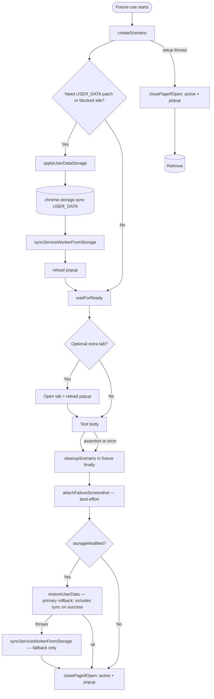

# Playwright tests

End-to-end tests for the browser extension. The runner only picks up files under `specs/` (`playwright.config.js` → `testDir: 'specs'`). Root-level `seed.spec.js` is a **non-executed** template for authors and MCP tooling.

---

## Runtime flow (architecture diagram)

Scenario fixtures (`siteBlockerFixture`, `shortTimerFixture`, etc.) call **`createScenario`** then yield to the test, and always run **`cleanupScenario`** in a `finally` block. The diagram below is the mental model for that path: **fixture setup → storage + service worker → test → teardown**.

**What each layer owns**

| Piece | Responsibility |
|--------|----------------|
| **`createScenario`** | Open the popup, optionally **`applyUserDataStorage`** (write `USER_DATA`, **`syncServiceWorkerFromStorage`**, reload), optional **`activeTabUrl`**, optional **`afterInit`**, return `{ page, popupPage, activePage, originalUserData, storageModified }`. |
| **`cleanupScenario`** | Runs after the test **passes or fails** (fixture `finally`): failure screenshot if applicable; if `storageModified`, **`restoreUserData`** (rollback); **`syncServiceWorkerFromStorage`** only if **`restoreUserData` threw**; then close pages. |
| **Tests under `specs/`** | Act on the UI through **`PopupPage`** only; assert. No direct `chrome.storage` wiring — that belongs in fixtures or `beforeEach`/`afterEach` / `try`/`finally` when documented. |

**Branches in the diagram**

- **Success path:** storage mutation (if any) → SW sync → reload → test → `cleanupScenario` → `restoreUserData` when needed → close pages.
- **Setup failure (`createScenario` throws):** only **page teardown** in the `catch` — **no `USER_DATA` rollback** in that path (rare mid-setup failure; see [Mental model](#mental-model-of-test-lifecycle)).
- **Test failure:** same **`cleanupScenario`** as success — Playwright still runs the fixture `finally`.

---

## Mental model of test lifecycle

### When a test starts

1. Playwright resolves fixtures (`extensionContext`, `popupUrl`, …).
2. For **`popupPage`**: base fixture opens the popup, builds **`PopupPage`**, **`waitForReady`**, then runs the test.
3. For **scenario fixtures**: **`createScenario`** opens a page, applies optional **`USER_DATA`** state, syncs the service worker, reloads, may open an **active** tab, then the test receives **`popupPage`** / **`activePage`** handles.

### When storage is mutated

- **Programmatic changes** go to **`chrome.storage.sync`** key **`USER_DATA`** (not `local`).
- After writes, **`syncServiceWorkerFromStorage`** pushes storage into the service worker’s in-memory **`Vars`** (see `userDataStorage.js` header).
- **`restoreUserData`** is the **primary** way to roll back **`USER_DATA`**; on success it writes storage **and** syncs — callers should **not** call **`syncServiceWorkerFromStorage`** again after a successful restore.
- **`cleanupScenario`** calls **`syncServiceWorkerFromStorage`** **only** if **`restoreUserData`** throws (best-effort alignment). In rare cases **`restoreUserData`** may persist storage then fail during sync; the catch then runs **`sync`** a **second time** — not duplication on the happy path, but a second attempt after failure.

### When a test fails

- The scenario fixture’s **`finally`** still runs **`cleanupScenario`** (unless the process is killed).
- **`attachFailureScreenshot`** runs best-effort; failures there do not skip **`restoreUserData`** or page closes.

### What `cleanupScenario` guarantees vs does not

| Guarantees (best-effort) | Does not guarantee |
|--------------------------|-------------------|
| Attempts **`restoreUserData`** when **`storageModified`** is true | That **`restoreUserData`** always succeeds (failures are swallowed after fallback sync attempt) |
| Attempts **`syncServiceWorkerFromStorage`** if **`restoreUserData`** throws | Rollback of **`USER_DATA`** if **`createScenario`** throws **after** a partial mutation (only page close runs today) |
| Closes **`activePage`** and the popup **`page`** when reachable | Ordering relative to other tests if the browser crashes |

**`base.js` `popupPage` fixture (non-scenario):** teardown is **`attachFailureScreenshot`** + **`page.close`** only — no **`cleanupScenario`**.

---

## Architecture (where things live)

| Layer | Role |
|--------|------|
| **`fixtures/base.js`** | Extends Playwright’s `test` with the Chromium extension context, `popupPage`, `newPopupPage`, etc. |
| **`fixtures/index.js`** | Single merge of `base` + scenario fixtures (`historyFixture`, `siteBlockerFixture`, `shortTimerFixture`). Import this when you need anything beyond `popupPage`. |
| **`fixtures/scenarioBuilder.js`** | Shared **how** for scenarios that touch `chrome.storage.sync` and optional extra tabs: `createScenario` / `cleanupScenario`, plus `applyUserDataStorage`. Fixtures declare *what* state they need; the builder wires sync, reload, and teardown. |
| **`fixtures/userDataStorage.js`** | **USER_DATA** (and Histogram) helpers: read/write sync storage, **`syncServiceWorkerFromStorage`**, `snapshotUserData` / **`restoreUserData`**, `resetServiceWorkerPomodoro`. |
| **`pages/popupPageModel.js`** | Page Object Model (POM): locators and actions. Tests interact with the UI **only** through `PopupPage`. |
| **`constants/testConstants.js`** | Default timer values, hosts, URLs — use in assertions instead of magic numbers/strings. |

### Page Object Model rules

- Add **getters** (Playwright `Locator`s) and **action** methods on `PopupPage`; do not scatter `page.getByTestId` / `page.locator` in spec files.
- Prefer `data-testid` where the app exposes it; the POM documents the pattern in its header comment.
- **`expect` in the POM file** (`popupPageModel.js`) is allowed for that module only; **specs** import `expect` from **`fixtures`** (or `fixtures/index`), not from `@playwright/test` directly.

---

## How to write a test

1. **Arrange / Act / Assert (AAA)** — structure each test so setup, interaction, and checks are obvious (comments are fine for non-trivial flows).
2. **Imports** — `const { test, expect } = require('../../fixtures');` or `require('../../fixtures/index')` for extended fixtures. **Do not** import `test` / `expect` from `@playwright/test` in spec files (keeps extended fixtures and consistent timeouts/reporters).
3. **No raw selectors in specs** — use `popupPage.someGetter` or `popupPage.someAction()` only.
4. **No hard waits** — avoid `page.waitForTimeout`. Prefer locators, `expect.poll`, or POM helpers that wait on UI/timer state (bounded polling for timers is acceptable where documented in existing specs).

---

## Storage rules (`USER_DATA` and the service worker)

Chrome extension state for these tests is **`chrome.storage.sync`** key **`USER_DATA`** (not `local`). After **any** programmatic change to that storage, the service worker must see the same data: call **`syncServiceWorkerFromStorage(page, ['USER_DATA'])`** (and include `'Histogram'` when you change that key). **`userDataStorage.js`** implements this; **`scenarioBuilder`** uses it on the **forward** setup path; **`cleanupScenario`** uses **`restoreUserData`** first, **`syncServiceWorkerFromStorage`** only if restore throws.

### When you mutate USER_DATA in a spec

- **Snapshot before** the mutation (e.g. `snapshotUserData(popupPage.page)` in `beforeEach`), **restore after** (`restoreUserData` + often `resetServiceWorkerPomodoro` for timer isolation) in `afterEach`, with `.catch(() => {})` on teardown so one failure does not mask the next.
- **Per-test `try` / `finally`**: use when a **single test** applies a one-off patch (e.g. `patchUserData`) and you must restore in `finally` — see `edge-cases.spec.js` for this pattern.

### When cleanup runs

- **Scenario fixtures** run **`cleanupScenario`** in a `finally` block: **`restoreUserData`** when `storageModified` (with fallback sync only if restore throws), then close pages, failure screenshot best-effort.
- **`beforeEach` / `afterEach`** on a `describe`: use for suites where **many tests** share the same storage mutation pattern.

### Fixture vs manual setup

| Prefer | When |
|--------|------|
| **New or extended fixture** (+ `scenarioBuilder` if needed) | The same “given” state (blocked site, short timer, history JSON, extra tab) is reused across multiple tests or files. |
| **`beforeEach` / `afterEach` + `userDataStorage`** | One suite needs snapshot/restore but no new named fixture is justified yet. |
| **`try` / `finally` + `restoreUserData`** | A single test patches USER_DATA inline; keep restore next to the test. |

**Golden rule:** keep **heavy setup and teardown out of the test body** — either a fixture, `beforeEach`/`afterEach`, or a small `try`/`finally` paired with the mutation. Tests should read as **Act + Assert** on top of a clear Arrange layer.

---

## Related files

- **`seed.spec.js`** — Annotated template (MCP / human): imports, AAA, storage, POM. Not run by Playwright.
- **`test-plan.md`** files under `specs/**` — Per-area coverage notes.
